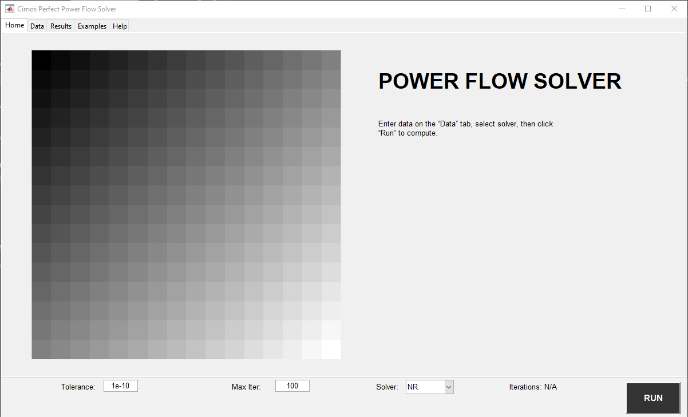

## Prerequisite

1. Verify that version **9.12 (R2022a)** of the MATLAB Runtime is installed.
   If it is not installed, run the MATLAB Runtime installer. To locate the installer, enter the following at the MATLAB prompt:

   ```matlab
   >> mcrinstaller
   ```

   > **Note:** You will need administrator rights to run the MATLAB Runtime installer.

2. Alternatively, download and install the Windows version of the MATLAB Runtime for R2022a from MathWorks:

   [MATLAB Runtime R2022a Download](https://www.mathworks.com/products/compiler/mcr/index.html)


